<!-- ████████████████████████████████████████████████ -->
<!--         YASH PATEL — GITHUB PROFILE README        -->
<!-- ████████████████████████████████████████████████ -->

<div align="center">
  
</div>

<br/>

<!-- ═══ MISSION LOG TICKER ═══ -->
<div align="center">
  
</div>

<br/>

<!-- ═══ PROJECT INTEL PANELS ═══ -->

<table align="center" width="100%">
<tr>
<td width="50%" valign="top">

**`[0x001]` BharatHire AI** &nbsp;`🟢 ACTIVE`
```
Stack   →  Next.js 15 · Supabase · Gemini 2.5 Flash
Event   →  OceanLab × CHARUSAT Hacks 2026
Cost    →  ₹0 architecture
```
AI-powered hiring platform for Bharat. Three features no other platform ships: Pre-Rejection Risk Score, Skill Proof Builder, and a Hinglish Career Coach with voice output.

</td>
<td width="50%" valign="top">

**`[0x002]` EmotiScan Pro v2** &nbsp;`🔵 TRAINING`
```
Model   →  EfficientNet-B2 + DeepFace Ensemble
Data    →  ~68,871 samples (FER2013+FER++RAF+CK+)
Extras  →  MediaPipe 468pt · Kalman · FACS AUs
```
Real-time facial emotion recognition — Happy, Neutral, Sad, Angry — with landmark-guided stabilization and ensemble confidence scoring.

</td>
</tr>
<tr>
<td width="50%" valign="top">

**`[0x003]` CivicPulse** &nbsp;`⚡ DEPLOYED`
```
Stack   →  Next.js 14 · MongoDB · PWA
Scale   →  16 Wards · 5 Roles · GPS auto-assign
SLA     →  Auto-escalation · Zero manual override
```
Civic issue reporting for Anand District. Citizens report, GPS assigns the ward, SLA engine escalates automatically. No rejection feature — only resolution.

</td>
<td width="50%" valign="top">

**`[0x004]` Multimodal RAG — SIH/NTRO** &nbsp;`✅ COMPLETE`
```
Type    →  Retrieval-Augmented Generation pipeline
Input   →  Multi-format documents
Client  →  NTRO · Smart India Hackathon
```
Intelligent document Q&A across complex, mixed-format government data sources. Built for national-level hackathon.

</td>
</tr>
</table>

<br/>

<!-- ═══ TECH STACK HUD ═══ -->

<div align="center">
  
</div>

<br/>

<!-- ═══ LIVE STATS ═══ -->

<div align="center">


&nbsp;&nbsp;


</div>

<br/>

<div align="center">
  
</div>

<br/>

<!-- ═══ CONTRIBUTION SNAKE ═══ -->

<div align="center">
  
  
</div>

<br/>

<!-- ═══ CONNECT ═══ -->

<div align="center">

[](https://yashpatel13.netlify.app)
&nbsp;
[](https://github.com/Deadpool20x)

</div>

<br/>

<div align="center">
  
</div>
